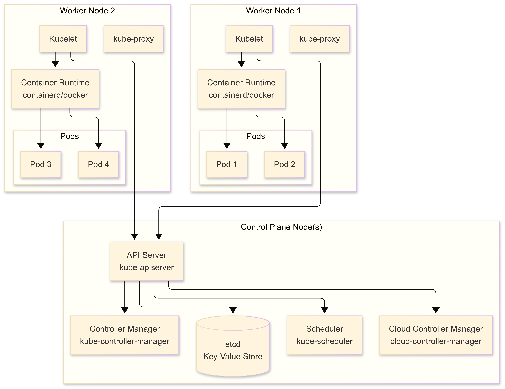

# Kubernetes Introduction

This section introduces core Kubernetes concepts that are essential for understanding how Operators work.

## Kubernetes Architecture

Before diving into concepts, let's understand how Kubernetes is structured. A Kubernetes cluster consists of two main types of nodes:

### Control Plane Components

The control plane manages the cluster and makes global decisions:



#### Control Plane Components Explained

**API Server (kube-apiserver)**
- Central management entity and entry point for all REST commands
- Validates and configures data for API objects (pods, services, etc.)
- Serves the Kubernetes API used by all components

**etcd**
- Distributed key-value store that holds cluster state
- Source of truth for all cluster data
- Highly available and consistent

**Scheduler (kube-scheduler)**
- Assigns pods to nodes based on resource requirements
- Considers factors like resource availability, constraints, and policies
- Makes scheduling decisions but doesn't actually run pods

**Controller Manager (kube-controller-manager)**
- Runs controller processes that regulate cluster state
- Examples: Node Controller, Replication Controller, Endpoints Controller
- Each controller is a separate process, but compiled into a single binary

**Cloud Controller Manager (cloud-controller-manager)**
- Manages cloud-specific control logic
- Allows cloud providers to integrate with Kubernetes
- Optional component (not needed for local clusters like kind)

### Worker Node Components

Worker nodes run your application workloads:

**Kubelet**
- Primary node agent that communicates with the API server
- Manages pods and their containers on the node
- Reports node and pod status back to the control plane

**kube-proxy**
- Network proxy that maintains network rules
- Enables communication between pods and services
- Implements Kubernetes Service concept

**Container Runtime**
- Software responsible for running containers
- Examples: containerd, CRI-O, Docker (deprecated)
- Pulls images and runs containers

### Communication Flow

1. **User/Client** → API Server (kubectl, web UI, or API calls)
2. **API Server** → etcd (stores desired state)
3. **Controllers** → API Server (watch for changes)
4. **Scheduler** → API Server (assigns pods to nodes)
5. **Kubelet** → API Server (gets pod assignments)
6. **Kubelet** → Container Runtime (starts/stops containers)

## What is Kubernetes?

Kubernetes is an open-source container orchestration platform that automates the deployment, scaling, and management of containerized applications. It provides:

- **Declarative Configuration**: Describe desired state, Kubernetes makes it happen
- **Self-Healing**: Automatically replaces failed containers
- **Scaling**: Horizontal and vertical scaling of applications
- **Service Discovery**: Built-in networking and load balancing
- **Rolling Updates**: Zero-downtime deployments

## Core Kubernetes Concepts

### Pods

The smallest deployable unit in Kubernetes. A Pod contains one or more containers that share:
- Network (IP address and ports)
- Storage volumes
- Lifecycle

```yaml
# Example Pod manifest
apiVersion: v1
kind: Pod
metadata:
  name: nginx-pod
  labels:
    app: nginx
spec:
  containers:
  - name: nginx
    image: nginx:1.21
    ports:
    - containerPort: 80
```

### Deployments

Manages a set of identical Pods, providing:
- Desired replica count
- Rolling updates
- Rollback capabilities
- Self-healing

```yaml
# Example Deployment
apiVersion: apps/v1
kind: Deployment
metadata:
  name: nginx-deployment
spec:
  replicas: 3
  selector:
    matchLabels:
      app: nginx
  template:
    metadata:
      labels:
        app: nginx
    spec:
      containers:
      - name: nginx
        image: nginx:1.21
        ports:
        - containerPort: 80
```

### Services

Provides stable networking for Pods:
- Stable IP address and DNS name
- Load balancing across Pod replicas
- Service discovery

```yaml
# Example Service
apiVersion: v1
kind: Service
metadata:
  name: nginx-service
spec:
  selector:
    app: nginx
  ports:
  - port: 80
    targetPort: 80
  type: ClusterIP
```

### ConfigMaps and Secrets

**ConfigMaps** store non-sensitive configuration data:

```yaml
apiVersion: v1
kind: ConfigMap
metadata:
  name: app-config
data:
  database_url: "postgres://localhost:5432/mydb"
  log_level: "info"
```

**Secrets** store sensitive data (base64 encoded):

```yaml
apiVersion: v1
kind: Secret
metadata:
  name: app-secrets
type: Opaque
data:
  username: YWRtaW4=  # admin
  password: MWYyZDFlMmU2N2Rm  # 1f2d1e2e67df
```

## Kubernetes API and Resources

### API Structure

Kubernetes uses a RESTful API organized by:
- **API Groups**: Logical groupings (apps/v1, v1, etc.)
- **Versions**: API version (v1, v1beta1, v1alpha1)
- **Resources**: Object types (pods, deployments, services)

### Resource Hierarchy

```
Cluster
├── Namespaces
│   ├── Pods
│   ├── Deployments
│   ├── Services
│   ├── ConfigMaps
│   └── Secrets
└── Cluster-wide Resources
    ├── Nodes
    ├── PersistentVolumes
    └── CustomResourceDefinitions
```

### Labels and Selectors

Labels are key-value pairs attached to resources:

```yaml
metadata:
  labels:
    app: nginx
    version: "1.21"
    environment: production
```

Selectors query resources by labels:

```yaml
selector:
  matchLabels:
    app: nginx
    environment: production
```

## Hands-on Exercise: Deploy Your First Application

Let's deploy a simple application to understand these concepts:

### Step 1: Create a Namespace

```bash
kubectl create namespace workshop-demo
kubectl config set-context --current --namespace=workshop-demo
```

### Step 2: Deploy an Application

Create a file called `demo-app.yaml`:

```yaml
apiVersion: apps/v1
kind: Deployment
metadata:
  name: demo-app
  namespace: workshop-demo
spec:
  replicas: 2
  selector:
    matchLabels:
      app: demo-app
  template:
    metadata:
      labels:
        app: demo-app
    spec:
      containers:
      - name: app
        image: nginx:1.21
        ports:
        - containerPort: 80
---
apiVersion: v1
kind: Service
metadata:
  name: demo-app-service
  namespace: workshop-demo
spec:
  selector:
    app: demo-app
  ports:
  - port: 80
    targetPort: 80
  type: ClusterIP
```

Apply the manifest:

```bash
kubectl apply -f demo-app.yaml
```

### Step 3: Verify the Deployment

```bash
# Check deployment status
kubectl get deployments

# Check pods
kubectl get pods

# Check service
kubectl get services

# Get detailed information
kubectl describe deployment demo-app
```

### Step 4: Test the Application

```bash
# Port forward to access the service
kubectl port-forward service/demo-app-service 8080:80

# In another terminal, test the connection
curl http://localhost:8080
```

## Understanding Kubernetes State Management

### Desired vs Current State

Kubernetes continuously works to match the current state with the desired state:

- **Desired State**: What you declare in YAML manifests
- **Current State**: What's actually running in the cluster
- **Reconciliation**: Process of making current state match desired state

### The Control Loop

```
┌─────────────────┐    ┌──────────────────┐    ┌─────────────────┐
│   Desired       │    │   Controller     │    │   Current       │
│   State         │───▶│   (Reconciler)   │───▶│   State         │
│   (YAML)        │    │                  │    │   (Cluster)     │
└─────────────────┘    └──────────────────┘    └─────────────────┘
                              ▲                          │
                              │                          │
                              └──────────────────────────┘
                                    Observe & Compare
```

This control loop is the foundation of how Kubernetes Operators work!

## Key Takeaways

1. **Declarative Model**: You describe what you want, Kubernetes figures out how to achieve it
2. **Labels and Selectors**: The glue that connects different resources
3. **Controllers**: Components that implement the control loop pattern
4. **API-Driven**: Everything in Kubernetes is an API resource
5. **Extensible**: Custom resources and controllers extend Kubernetes functionality

## Cleanup

Remove the demo resources:

```bash
kubectl delete namespace workshop-demo
```

## Next Steps

Now that you understand basic Kubernetes concepts, let's dive deeper into how controllers work:
- [02 - Controllers and Reconciliation](02-controllers.md)

---

**Navigation:**
- **Previous:** [← Setup Guide](00-setup.md)
- **Next:** [Controllers →](02-controllers.md)
- **Home:** [Workshop Overview](../README.md)